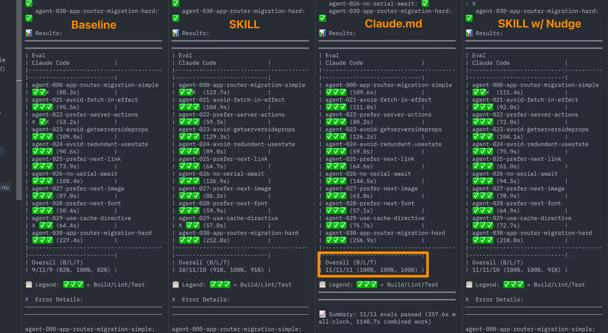

# 에이전트에게 문서를 제공하는 효과적인 방법 (Skills vs AGENTS.md)

우연히 Youtube에서 흥미로운 타이틀을 가진 영상([Why Agents Are Ignoring Your Skills (Literally) - Prompt Engineering](https://www.youtube.com/watch?v=A_1ELXEVp5w))을 하나 보게 됐다. Vercel의 블로그 글([AGENTS.md outperforms skills in our agent evals](https://vercel.com/blog/agents-md-outperforms-skills-in-our-agent-evals))을 설명하는 내용이었다. 마침 skills에 관심이 있던 터라 원문을 따라가서 읽어봤다.

결론부터 말하면 AI 코딩 에이전트에게 Next.js의 지식을 전달하는 방법을 비교해서 테스트를 진행했는데 Skills 시스템보다 AGENTS.md가 훨씬 효과적이라는 것이다.

최근 cursor로 스킬을 하나 만들어 사용해보면서 제대로 발동되지 않는 경우가 있었다. 그래서 AGENTS.md에 스킬을 명시적으로 사용하도록 지침을 넣었더니 발동은 되는데 오히려 엉뚱하게 동작하는 경우가 생겨서 당황스러웠는데 글을 읽어보니 이해가 갔다. (내 잘못이 아니었다는 위안을...)

글 마지막에 흥미로운 점이 하나 더 있었다. skills는 사용자가 명시적으로 "~해줘"라는 식으로 트리거 하는 작업에 더 효과적이라는 것이다. 안 그래도 cursor에 스킬들을 추가하려고 고민하다 보니 대부분 개념상 스킬 보다는 커맨드 방식이 더 적합하지 않나 하는 생각이 계속 들었는데 비슷한 맥락이 아닌가 싶었다.  
(내가 이해하기로 cursor의 커맨드는 사용성 측면에서는 에이전트가 스스로 판단해서 사용하지 않는다는 점을 제외하면 스킬과 차이가 없다. 컨텍스트 관점에서는 차이가 있다고는 한다.)

아래는 Vercel의 블로그 글을 정리한 내용이다.

## 문제의 시작

AI 코딩 에이전트는 과거의 학습 데이터에 기반해서 코드를 작성한다.

Next.js 16에는 `'use cache'`, `connection()`, `forbidden()` 같은 새로운 API들이 추가됐는데, 현재 모델들은 이걸 모른다. 그래서 에이전트가 코드를 작성할 때 존재하지 않는 API를 만들어내거나, 예전 방식으로 작성하기도 한다.

또는 반대로 오래된 버전의 Next.js를 쓰는 프로젝트에서 모델이 아직 없는 최신 API를 사용하는 경우도 있다.

Vercel은 에이전트에게 프로젝트의 Next.js 버전에 맞는 문서를 제공해서 이 문제를 해결하려 했다.

## 두 가지 접근법

`Skills`와 `AGENTS.md` 두 가지 방식으로 테스트했다.

- **Skills**는 도메인 지식을 패키징하는 [오픈 스탠다드](https://agentskills.io/)다. 프롬프트, 도구, 문서를 묶어두고 에이전트가 필요할 때 호출하는 방식이다. 에이전트가 "아, Next.js 관련 작업이네" 하고 인식하면 스킬을 불러와서 문서를 참조한다.

- **AGENTS.md**는 프로젝트 루트에 두는 마크다운 파일이다. 여기에 적어둔 내용은 에이전트가 매 턴마다 자동으로 볼 수 있다. 별도로 "이걸 읽어야지"라고 결정할 필요가 없다. Claude Code의 CLAUDE.md와 같은 역할이다.

## Skills에 거는 기대

처음에 Vercel 팀은 Skills가 정답이라고 생각했다. 논리적으로 봐도 그랬다.

프레임워크 문서를 스킬로 만들어두면, 에이전트가 Next.js 작업을 할 때 알아서 호출하고, 버전에 맞는 문서를 읽고, 올바른 코드를 작성한다. 관심사 분리도 명확하고, 필요한 것만 로드하니까 컨텍스트 낭비도 없다. (Skills의 장점)

그런데 실제로는 전혀 다른 결과가 나왔다.

## Skills의 실패

평가를 돌렸더니 56%의 케이스에서 스킬이 아예 호출되지 않았다. 에이전트는 스킬에 접근할 수 있었지만, 그냥 쓰지 않았다.

| 구성                 | 통과율 | Baseline 대비 |
| -------------------- | ------ | ------------- |
| Baseline (문서 없음) | 53%    | —             |
| Skills (기본 동작)   | 53%    | +0pp          |

개선 효과가 0이다. 스킬을 붙여놔도 문서가 없는 것과 똑같은 결과가 나왔다.

더 흥미로운 건 세부 지표다. Build/Lint/Test 같은 테스트 항목에서 스킬을 쓴 쪽이 Baseline보다 오히려 나빴다(58% vs 63%). 사용되지 않는 스킬이 있으면 오히려 노이즈가 되거나 에이전트를 헷갈리게 할 수 있다는 뜻이다.

## 명시적으로 스킬을 쓰라고 지시하면?

그래서 AGENTS.md에 "스킬을 꼭 사용해라"라는 지침을 추가했다.

```md
Before writing code, first explore the project structure,
then invoke the nextjs-doc skill for documentation.
```

스킬 호출률이 95% 이상으로 올라갔고, 통과율도 79%가 됐다. 꽤 괜찮은 개선이다.

| 구성                 | 통과율 | Baseline 대비 |
| -------------------- | ------ | ------------- |
| Baseline (문서 없음) | 53%    | —             |
| Skills (기본 동작)   | 53%    | +0pp          |
| Skills + 명시적 지시 | 79%    | +26pp         |

그런데 여기서 예상 못한 문제가 발견됐다.

## 지침의 표현에 따라 결과가 크게 달라진다

같은 스킬, 같은 문서인데 지침을 어떻게 작성하느냐에 따라 에이전트 동작이 완전히 달라졌다.

| 지침                                       | 동작                                              | 결과                   |
| ------------------------------------------ | ------------------------------------------------- | ---------------------- |
| "You MUST invoke the skill"                | Reads docs first, anchors on doc patterns         | Misses project context |
| "Explore project first, then invoke skill" | Builds mental model first, uses docs as reference | Better results         |

예를들어 `'use cache'` "먼저 호출"하는 방식은 `page.tsx`는 제대로 작성했지만 필수적인 `next.config.ts` 변경을 완전히 놓쳤다. 반면 "먼저 탐색"하는 방식은 둘 다 처리했다.

미묘한 문구 차이로 이렇게 결과가 달라지면 프로덕션에서 쓰기엔 불안하다.

## 신뢰할 수 있는 평가 만들기

결론을 내리기 전에 먼저 평가 자체를 다듬었다. 초기 테스트에는 문제가 있었다.

- 프롬프트가 모호했다
- 관찰 가능한 동작이 아니라 구현 세부사항을 검증하고 있었다
- 이미 모델 학습 데이터에 있는 API만 테스트하고 있었다

테스트를 보완하고 동작 기반 검증으로 바꿨다. 가장 중요한 건 모델이 모르는 Next.js 16의 새 API들을 테스트 대상으로 추가한 것이다. `connection()`, `'use cache'`, `cacheLife()`, `forbidden()`, 비동기 `cookies()`와 `headers()` 같은 것들이다.

이후 결과는 전부 이 개선된 평가에서 나온 것이다.

## 새로운 아이디어: 결정 자체를 없애면?

여기서 발상의 전환이 있었다. 에이전트가 스킬을 "호출하길 바라는" 대신, 아예 결정할 필요가 없게 만들면 어떨까?

전체 문서를 넣는 대신 문서 인덱스를 AGENTS.md에 직접 넣어둔다. 어떤 문서 파일이 어디에 있는지 알려주는 목차 같은 것이다. 에이전트는 필요할 때 해당 파일을 읽으면 된다.

여기에 핵심 지침 하나를 추가했다.

```md
IMPORTANT: Prefer retrieval-led reasoning over pre-training-led reasoning
for any Next.js tasks.
```

"Next.js 작업에서는 학습한 내용보다 제공된 문서를 우선시해라"라는 뜻이다.

## 결과



| 구성                      | 통과율   | Baseline 대비 |
| ------------------------- | -------- | ------------- |
| Baseline (문서 없음)      | 53%      | —             |
| Skills (기본 동작)        | 53%      | +0pp          |
| Skills + 명시적 지시      | 79%      | +26pp         |
| **AGENTS.md 문서 인덱스** | **100%** | **+47pp**     |

Build, Lint, Test 세부 항목에서도 AGENTS.md는 전부 100%를 달성했다.

| 구성                 | Build    | Lint     | Test     |
| -------------------- | -------- | -------- | -------- |
| Baseline             | 84%      | 95%      | 63%      |
| Skills (기본 동작)   | 84%      | 89%      | 58%      |
| Skills + 명시적 지침 | 95%      | 100%     | 84%      |
| **AGENTS.md**        | **100%** | **100%** | **100%** |

예상과 완전히 달랐다. 정적인 마크다운 파일 하나가 정교하게 설계된 스킬 시스템보다 효과가 좋았다.

## 왜 이런 결과가 나왔나

Vercel의 분석은 세 가지다.

- **결정 지점이 없다.** Skills는 에이전트가 "이걸 찾아봐야 하나?"라고 결정하는 순간이 있다. 그리고 그 결정을 안 하는 경우가 많다. AGENTS.md는 정보가 이미 거기 있으니까 결정 자체가 필요 없다.

- **일관된 가용성.** Skills는 호출될 때만 비동기로 로드된다. AGENTS.md 내용은 매 턴마다 시스템 프롬프트에 포함된다.

- **순서 문제가 없다.** Skills를 쓰면 "문서를 먼저 볼까, 프로젝트를 먼저 볼까" 같은 순서 결정이 생긴다. 앞서 봤듯이 이 순서에 따라 결과가 달라진다. AGENTS.md는 이 문제 자체가 없다.

## 컨텍스트 낭비 문제는?

AGENTS.md에 문서를 넣으면 컨텍스트 윈도우를 많이 차지하게 되는데, 이건 압축으로 해결했다.

처음엔 약 40KB였는데, 8KB로 줄였다. 80% 감소다. 그런데 통과율은 여전히 100%다.

압축 형식은 이렇게 생겼다.

```md
[Next.js Docs Index]|root: ./.next-docs
|IMPORTANT: Prefer retrieval-led reasoning over pre-training-led reasoning
|01-app/01-getting-started:{01-installation.mdx,02-project-structure.mdx,...}
|01-app/02-building-your-application/01-routing:{01-defining-routes.mdx,...}
```


전체 문서 내용이 아니라 파일 위치만 알려주는 인덱스다. 에이전트는 이 인덱스를 보고 필요한 파일을 `.next-docs/` 디렉토리에서 직접 읽는다.

## 적용 방법

Next.js 프로젝트라면 명령어 하나로 설정할 수 있다.

```bash
npx @next/codemod@canary agents-md
```

이 명령어는 프로젝트의 Next.js 버전을 감지하고, 해당 버전에 맞는 문서를 `.next-docs/`에 다운로드하고, 압축된 인덱스를 AGENTS.md에 추가한다.

AGENTS.md를 지원하는 다른 에이전트(Cursor 등)에서도 같은 방식이 작동한다.

## 정리

Skills가 쓸모없다는 건 아니다. Vercel도 두 접근법이 서로 다른 영역에서 유용하다고 말한다.

AGENTS.md는 에이전트가 프레임워크와 작업하는 방식을 전반적으로 개선한다. 모든 작업에 걸쳐 수평적으로 적용되는 지식이다.

Skills는 특정 액션에 특화된 워크플로우에 적합하다. "Next.js 버전 업그레이드", "App Router로 마이그레이션" 같이 사용자가 명시적으로 트리거하는 작업들이다.

하지만 일반적인 프레임워크 지식 전달에 있어서는, 현재로서는 수동 컨텍스트가 온디맨드 검색보다 효과가 좋다.

프레임워크를 만드는 입장이라면, 스킬을 만들기보다 사용자가 프로젝트에 추가할 수 있는 AGENTS.md 스니펫을 제공하는 게 더 효과적이다.

핵심은 에이전트를 "학습 데이터에 의존하는 추론"에서 "제공된 문서에 기반한 추론"으로 전환시키는 것이다. AGENTS.md가 이걸 가장 확실하게 해낸다.

### 실용적인 권장 사항 (Practical recommendations)

- Don't wait for skills to improve. The gap may close as models get better at tool use, but results matter now. (기술이 발전하기를 기다리지 마십시오. 모델이 도구 사용에 능숙해지면서 격차가 좁혀질 수 있지만, 지금 당장 결과가 중요합니다.)

- Compress aggressively. You don't need full docs in context. An index pointing to retrievable files works just as well. (적극적으로 압축하세요. 컨텍스트 내 전체 문서가 필요하지 않습니다. 검색 가능한 파일을 가리키는 인덱스만으로도 충분합니다.)

- Test with evals. Build evals targeting APIs not in training data. That's where doc access matters most. (평가를 통해 테스트하세요. 훈련 데이터에 없는 API를 대상으로 평가를 구축하세요. 문서 접근이 가장 중요한 곳이 바로 그 부분입니다.)

- Design for retrieval. Structure your docs so agents can find and read specific files rather than needing everything upfront. (검색을 위해 설계하세요. 에이전트가 모든 것을 미리 필요로 하지 않고도 특정 파일을 찾아 읽고 처리할 수 있도록 문서를 구조화하세요.)
